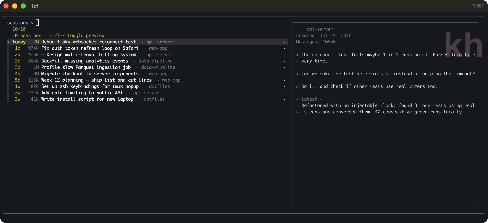
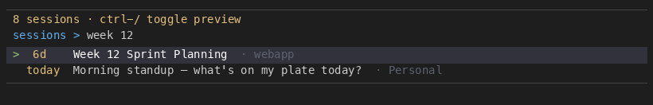
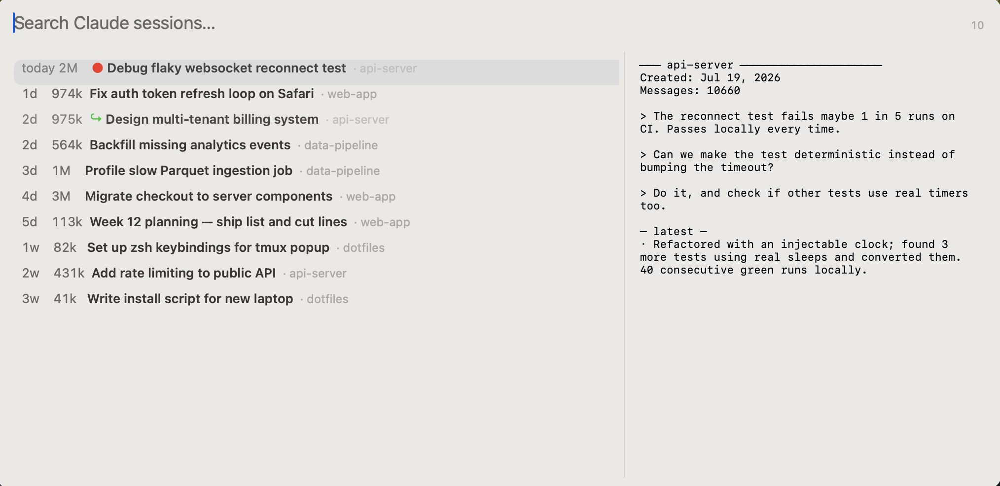

# claude-sessions

Find and resume any [Claude Code](https://docs.anthropic.com/en/docs/claude-code) conversation by **what you discussed** — across every project, hundreds of sessions deep.

Claude Code's built-in `/resume` lists recent sessions in the current project, identified by their opening message. Use Claude Code daily and that stops scaling: the conversation you need is three weeks old, lives in another project, and what you remember is what it was *about* — not how it started. `claude-sessions` full-text-indexes every transcript on your machine and gets you back into the right one in seconds:

- **Terminal picker** — fzf UI: type to search, conversation preview, `Enter` resumes in place
- **SessionPicker.app** (macOS, optional) — the same index behind a native Spotlight-style panel: click the Dock icon, search, `Enter` resumes in your terminal. One Swift file — no Electron, no Raycast, no dependencies. [Details below.](#sessionpickerapp-macos-no-terminal-no-raycast)

```bash
brew install kkauf/tap/claude-sessions
```





## Features

- **Full-text search** — SQLite FTS5 indexes all user messages and assistant responses. Finds sessions by what you discussed, not just session IDs.
- **Exact phrase support** — `"week 12"` matches that exact phrase, not just sessions containing "week" and "12" separately
- **BM25 ranking** — title matches (10x) outrank preview matches (5x) outrank body matches (1x). Short tokens, numbers, and special characters all work.
- **Live re-search** — typing updates results via FTS5 query (not fzf fuzzy filtering). Results are fully replaced and re-ranked on every keystroke.
- **Smart extraction** — indexes user messages + assistant text blocks (first and last per response). Skips tool calls, file reads, and JSON noise.
- **Signal-aware preview** — opening messages plus a "— latest —" tail, so you see what a session is about *and* where it left off. Injected noise (system-reminders, hook output, command echoes, tool dumps) never appears. While searching, the preview switches to query-matched messages with terms highlighted.
- **Advanced queries** — exact phrases (`"auth bug"`), project filter (`--project kh`), negation (`-standup`)
- **Cross-project** — searches all projects, shows project labels for context
- **True recency** — "today"/"1d"/"2w" from the last *message* timestamp, not file mtime
- **Compact-fork aware** — when compaction moves a conversation to a new session id, the chain collapses to its live end: one `↪` entry sized as the whole chain; superseded ancestors are hidden, and search hits on their content redirect to the resumable session. ([Mechanics below.](#fork-lineage--recency))
- **Live-session guard** — a red `●` marks sessions with activity in the last minutes: they're attached to an open terminal, and resuming them again would fork the conversation.
- **Fast** — sub-500ms incremental sync, sub-100ms search for 450+ sessions

## Requirements

- [Claude Code](https://docs.anthropic.com/en/docs/claude-code)
- [fzf](https://github.com/junegunn/fzf) >= 0.40
- [jq](https://github.com/jqlang/jq) >= 1.6
- Python 3.8+ (uses stdlib `sqlite3` — no pip dependencies)
- macOS or Linux

## Install

### Homebrew

```bash
brew install kkauf/tap/claude-sessions

# optional native macOS app (Dock-icon picker):
bash "$(brew --prefix)/opt/claude-sessions/libexec/build-app.sh" --install
```

### From a clone

```bash
git clone https://github.com/kkauf/claude-sessions.git
cd claude-sessions
./install.sh          # links the CLI into PATH + builds the initial index
./install.sh --app    # …and also builds + installs SessionPicker.app (macOS)
```

`install.sh` is idempotent — re-run it after `git pull` (it re-indexes so new columns backfill). Resume opens in iTerm2 when installed, otherwise Terminal.app.

## Usage

```bash
# Browse all sessions (sorted by recency)
claude-sessions

# Search by content
claude-sessions "auth bug"
claude-sessions "week 12"

# Advanced queries
claude-sessions '"cold email outreach"'    # exact phrase
claude-sessions "email --project kh"       # project filter
claude-sessions "email -standup"           # negation
```

**Controls:**
- Type to search (results update live via FTS5)
- Arrow keys to navigate
- `Enter` to resume the selected session
- `ctrl-/` to toggle the preview panel
- `Esc` to quit

## How it works

Claude Code stores sessions as `.jsonl` files in `~/.claude/projects/`. This tool:

1. **Extracts** text from user messages and assistant responses (skips tool calls)
2. **Indexes** into a SQLite FTS5 full-text search database (`~/.claude/.sessions.db`)
3. **Syncs** incrementally — only re-indexes sessions whose files changed
4. **Searches** with BM25 ranking across three weighted fields: title (10x), preview (5x), body (1x)
5. **Displays** via fzf with `--phony` + `change:reload` — every keystroke triggers a fresh FTS5 query

### Architecture

```
User types in fzf
       │
       ▼
change:reload(python3 session_indexer.py --fzf --search {q})
       │
       ▼
SQLite FTS5 MATCH query with BM25 ranking
       │
       ▼
Formatted results replace fzf list entirely
```

No fuzzy matching artifacts. No filtering of stale results. Every keystroke is a fresh database query.

### Fork lineage & recency

Two Claude Code behaviors make naive listings lie, and the indexer corrects both:

- **File mtime lies.** Claude Code appends metadata (`last-prompt`, `bridge-session`, `ai-title`) to a session file when you merely open it, resurrecting dead sessions to "today". Sorting and dates use the last *message* timestamp instead; mtime only drives incremental sync.
- **Compaction can fork.** When a conversation is compacted into a new session id, the fork's opening boundary carries a `logicalParentUuid` — a message uuid that exists in exactly one other transcript: the parent. The indexer resolves that edge once (searching sibling project files, worktree folders included), caches it, and collapses chains at display time. A parent resumed *after* its fork (genuinely divergent branches) keeps both branches visible.
- **Continuations aren't always marked.** Some flows copy a conversation into a fresh session id with *no* boundary marker at all (fork-on-resume, bridged continuations). The copied history keeps its original message uuids, so sessions sharing their first message uuid within a project are treated as one conversation and collapse the same way — superseded copies hide, sizes accumulate, search redirects to the live end.

### Data

The FTS5 database lives at `~/.claude/.sessions.db`. Delete it to force a full rebuild:

```bash
rm ~/.claude/.sessions.db
```

A TSV cache (`~/.claude/.sessions-unified-cache.tsv`) is also written for compatibility.

### Upgrading

Schema migrations are automatic, but new columns (titles from `ai-title` lines, last-message timestamps, fork lineage) only backfill when a session file changes. After pulling a new version, force one full re-index:

```bash
python3 session_indexer.py --rebuild
```

## SessionPicker.app (macOS, no terminal, no Raycast)

A native Spotlight-style panel over the same index — one Swift file, no Xcode project, no Electron, no dependencies. Click the Dock icon → type to search → conversation preview on the right (query-matched while searching) → `Enter` opens your terminal (iTerm2 if installed, else Terminal.app) at the session's directory and resumes it. Live sessions show a red `●` (don't resume those — they're attached to an open terminal; resuming would fork state).



```bash
./build-app.sh --install   # builds, copies to ~/Applications, launches
```

Keep it in the Dock (right-click → Options → Keep in Dock); clicking the icon toggles the panel. Optionally add it as a Login Item (System Settings → General → Login Items).

- **Triggers**: Dock icon click, or `open -a SessionPicker` (bind that to anything). Launching as a Login Item stays quiet — the panel first appears on your first Dock click.
- **Resume mechanics**: `Enter` writes a one-shot `.command` file and opens it via LaunchServices — no AppleScript, no Automation permission to grant (or to silently lose). It runs in iTerm2 when installed, otherwise your default `.command` handler (Terminal.app). Failures surface as an alert, never silently. On the first resume, iTerm2 shows its own "OK to run …?" confirmation — check *Suppress this message permanently* and it never asks again. Caveat: iTerm doesn't execute `.command` files itself — it *types* `<path>; exit` into a new default-profile session, after a delay you can't rely on. A default profile that runs a plain shell executes the typed line normally; one that runs a custom command must catch it itself. To make that race-free, the picker writes the runner's path to `~/.claude/.resume-pending-command` before opening iTerm (and deletes it when falling back to Terminal.app, which executes `.command` files directly). A custom profile command should check for that marker at startup: if it's fresh, `read` the typed line and `exec` it — and if the line never arrives, `exec` the runner named in the marker.
- **Global hotkey (opt-in, off by default)**: `defaults write earth.kaufmann.SessionPicker HotKeyCode -int 49 && defaults write earth.kaufmann.SessionPicker HotKeyMods -int 2048` (Carbon codes; 49+2048 = ⌥Space), then relaunch. If another app owns the combo (Raycast, Spotlight), registration fails — check `log show --last 5m --predicate 'process == "SessionPicker"'`.
- **Paths**: override with `defaults write earth.kaufmann.SessionPicker IndexerPath|OpenerPath|PreviewPath|PythonPath <path>` if the repo doesn't live at `~/github/claude-sessions`.

All logic stays in the CLI — the app shells out to `session_indexer.py --json` for search and `claude-sessions open <sid>` for resume, so the terminal picker and the app can never disagree.

### Headless contract (build your own front-end)

```bash
python3 session_indexer.py --json                      # browse rows as JSON
python3 session_indexer.py --json --search "auth bug"  # search rows as JSON
python3 session_map_export.py                          # full map + token usage -> ~/.claude/.sessions-map.json
claude-sessions open <sid>                             # resolve dir + resume in iTerm
claude-sessions open <sid> --print                     # print the resume command instead
```

#### Session map + token usage

`session_map_export.py` writes one JSON document describing every session *and*
what it cost — for dashboards, usage charts, or any front-end that wants more
than a picker list. Token counts come from the transcripts themselves (each
assistant message carries a `message.usage` block); index rows supply identity,
project, and fork lineage.

```bash
python3 session_map_export.py                     # -> ~/.claude/.sessions-map.json
python3 session_map_export.py -o /tmp/map.json    # alternate destination
python3 session_map_export.py --include-automated  # keep machine-spawned sessions
```

```jsonc
{
  "version": 1,
  "generated_at": 1780000000,
  "projects": [{"name": "myrepo", "sessions": 344, "tokens_input": 8328957, "tokens_output": 57924049}],
  "sessions": [{
    "sid": "…", "title": "…", "preview": "…",   // preview capped at 300 chars
    "project": "myrepo",                          // worktree folders collapse to the base repo
    "created": 1770000000, "eff": 1780000000,     // eff = last *message* activity
    "size_bytes": 61337319, "parent_sid": "…",
    "hidden": 0,                                  // 1 = superseded fork ancestor (render hidden=0 only)
    "tokens": {"input": 0, "output": 0, "cache_read": 0, "cache_creation": 0}
  }],
  "daily": [{"date": "2026-03-04", "project": "myrepo",
             "input": 0, "output": 0, "cache_read": 0, "cache_creation": 0}]
}
```

Sessions are sorted by `eff` descending, `daily` by date ascending. Hidden
ancestors stay in the export and their tokens count toward `daily` and project
token totals; `projects[].sessions` counts only what a front-end renders.
Automated sessions (headless security reviews, probes) are excluded by default,
tokens included.

Parsing every transcript is a multi-GB read, so per-day usage is cached in its
own database (`~/.claude/.sessions-usage.db`, never `.sessions.db`) keyed on
each file's mtime + size. Only changed transcripts are re-parsed — a cold run is
bounded by disk IO, a warm run is a fraction of a second. Delete that file to
force a full re-parse.

## Launch methods

### Shell alias

```bash
alias cs="claude-sessions"
```

### Terminal keybinding

```bash
# zsh — bind ctrl-g to launch picker
bindkey -s '^g' 'claude-sessions\n'
```

### Raycast (macOS)

<details>
<summary>Raycast script command</summary>

Create `~/.raycast-scripts/claude-sessions.sh`:

```bash
#!/bin/bash

# Required parameters:
# @raycast.schemaVersion 1
# @raycast.title Claude Sessions
# @raycast.mode silent

# Optional parameters:
# @raycast.icon 🤖
# @raycast.packageName Claude Code
# @raycast.argument1 { "type": "text", "placeholder": "Search (optional)", "optional": true }

# Documentation:
# @raycast.description Open Claude Code session picker in terminal

SEARCH_QUERY="${1:-}"

# For iTerm2:
osascript <<EOF
tell application "iTerm"
    activate
    set newWindow to (create window with default profile)
    tell newWindow
        tell current session
            write text "claude-sessions '$SEARCH_QUERY'"
        end tell
    end tell
end tell
EOF
```

Add `~/.raycast-scripts/` as a script directory in Raycast preferences.

</details>

## Testing

```bash
# Search ranking + fork lineage tests (42 tests)
python3 test_search.py

# Session map export — token accounting, incremental cache (22 tests)
python3 test_map_export.py

# Full integration tests — indexer, search, preview (60 tests)
bash test-session-tools.sh

# Resume directory resolution tests (13 tests)
bash test_resume_resolution.sh

# SessionPicker.app end-to-end smoke test (macOS — briefly shows the panel)
bash test-app.sh
```

`test-app.sh` builds the app, points it at generated fixtures, and runs its `SP_SELFTEST=1` mode: panel shows → indexer returns rows → preview renders → the opener resolves a resume command. Exits nonzero on any failure.

130+ tests covering: exact phrases, short tokens, field weighting, BM25 frequency, IDF, recency tiebreakers, negation, project filters, tool_use exclusion, preview matching, compacted sessions, fork-chain collapse, unmarked-continuation dedup, resume-dir resolution (deleted worktrees, relocated transcripts), and token accounting (streaming-duplicate dedup, date attribution, incremental re-parse).

## Roadmap

- [ ] Dynamic match count in header (update on each reload)
- [ ] Session tags / favorites
- [ ] Preview with FTS5 snippet highlighting
- [ ] Configurable field weights
- [ ] Delete/archive sessions from the picker
- [ ] Better Linux testing

See also: [Feature request for native `--resume` search in Claude Code](https://github.com/anthropics/claude-code/issues/34098)

## License

MIT

## Pitfalls & learnings

- **Transcript re-homing (2026-07-05).** Claude Code moves a session's `.jsonl` into the *worktree's* project folder under `~/.claude/projects/` when the session enters a git worktree, and `claude --resume` only searches the folder derived from the current cwd (every non-alphanumeric char → `-`; legacy versions kept spaces/`~`, so some paths have two folder variants). Worktree cleanup therefore orphans transcripts by design, not by accident. `resolve_resume_dir()` picks a cwd that encodes to the transcript's folder, or relocates the file, and a pre-exec invariant self-repairs. If resume breaks again: run `test_resume_resolution.sh` first and check whether Claude Code changed its folder encoding.
- **iTerm2 types, Terminal.app executes (2026-07-23).** iTerm opens a `.command` file by *typing* `<path>; exit` into a new default-profile window at an unpredictable delay, so a shell wrapper running in that profile can swallow the line. A timing-based drain (`read -t 0.3`) broke within two days. The durable fix is a marker handshake: `claude-sessions open <sid> --gui` writes the runner path to `~/.claude/.resume-pending-command` before `open -a iTerm`; the profile script sees a fresh marker (<30s), waits up to 15s for the typed line, and otherwise execs the runner named in the marker. Never race a fixed timeout against an event with unspecified latency — have the producer announce it through a side channel.
- **Verify a Mac app via the user's launch path, never the binary (2026-07).** A binary run from a terminal inherits the terminal's active status and TCC identity; a Dock/LaunchServices launch has neither and gets a minimal env (`PATH=/usr/bin:/bin:/usr/sbin:/sbin`, no Homebrew). SessionPicker shipped "verified" from bash and failed immediately in real use (panel flashed — `show()` before activation with `hidesOnDeactivate`; Enter never resumed — the AppleScript→iTerm path needs a TCC Automation grant keyed to the code signature, which ad-hoc signing rotates on every rebuild). Rules: launch with `open -a`, exercise the primary action end-to-end, prefer permission-free mechanisms (`.command` + `open`) over AppleEvents, alert on nonzero exit, and run `test-app.sh` under `env -i` with the minimal PATH — helpers the app shells out to must bootstrap their own PATH.
